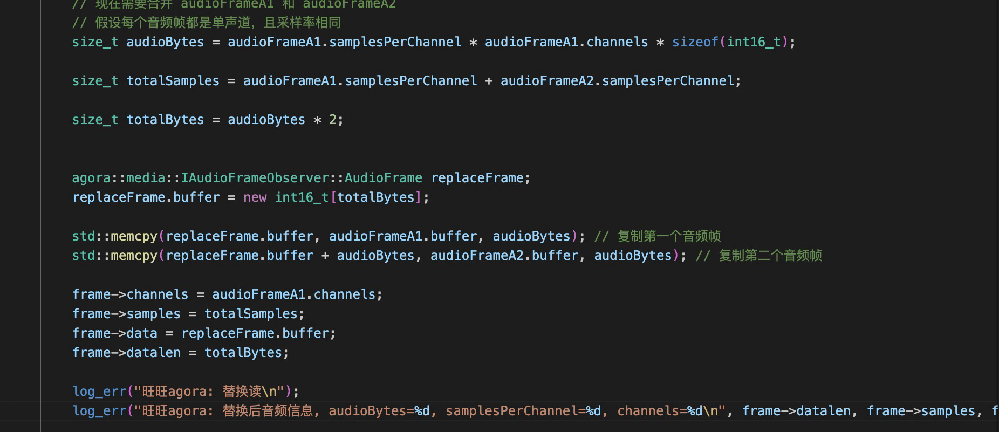
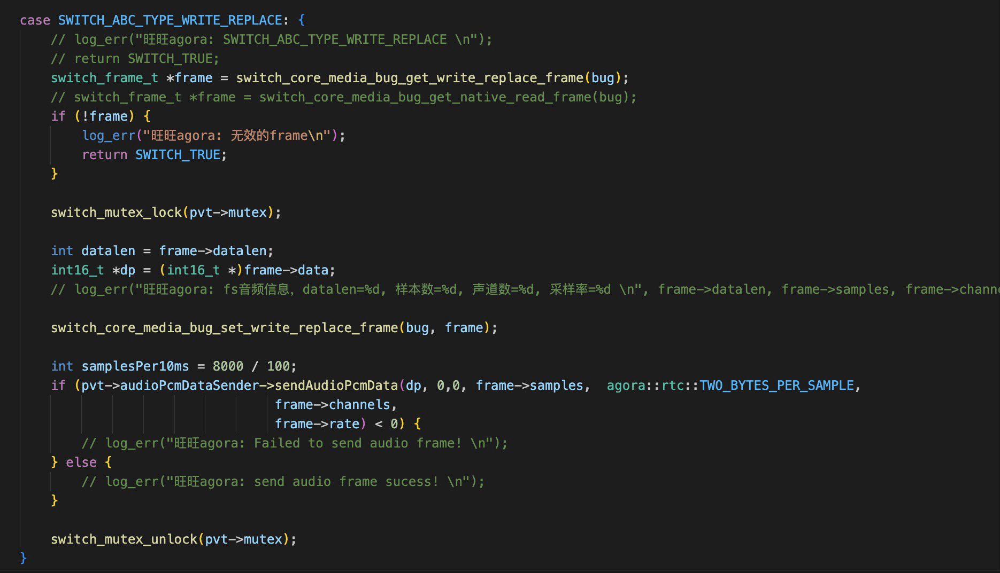

# 1、freeswitch和声网媒体流交互思路及实现
此处使用的方案是使用freeswitch的mod方式进行媒体数据的交换。
另一种方案计划做一个客户端，左手和fs对接的sip客户端，右手和agora对接的客户端，中间媒体数据在本地进行交换。

当前方案涉及：
1、fs mod的实现
2、mod makefile的引用关系
3、媒体数据的交换

首先设计一个音频队列环形缓存器：AudioFrameQueue
Agora的音频数据push
freeswitch从队列中pop

fs：
1、使用freeswitch的mediabug获取到readreplace和writereplace的audioframe
2、writereplace获取到的 switch audio frame  dump一份调用agora的音频发送声网，然后正常在fs replace。
3、fs的readplace回调时，从缓存器中pop两个agora frame。（原因：fs audio frame: 采样率8000、160samples/ch、1ch； agora frame： 采样率8000、80samples/ch、1ch）。将agora audio frame拼接后转成fs的audio frame，然后进行replace

agora：
参考agora的sdk 和example

readreplace

Writereplace

文件为：
agora的观察者
音频缓存器的实现v

Vx: bkack2w，欢迎交流
