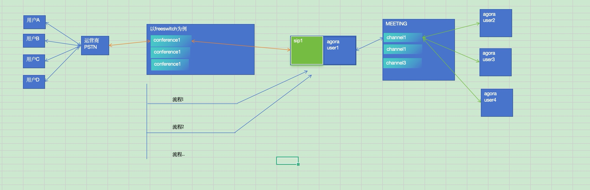

# freeswitch会议和agora会议的实现方式

## 前面的方案已经实现的情况下设计如下系统
### 用户使用PSTN接入freeswitch的会议中，然后通过前面实现的客户端打通sip和agora的会议。agora会议可以换成其他的会议。

## 接下来设计一个管理层
### 1、新建agora频道channel1， 新建agora用户user1；同时新建fs conference1, 新建sip用户sip1。进行绑定作为配置1
## 2、第一个用户通过PSTN进入会议的时候，进入流程1。
### 2.1、开启sip-agora背靠背进程
### 2.2、给sip-agora背靠背进程下发配置1
### 2.3、sip-agora背靠背进程，sip以sip1进fs-conference1、agora以user1进agora-channel1

## 3、会议结束后（系统定义）
### 3.1、清理相关资源，conference\channel\sip user\agora user
### 。。。

# 
