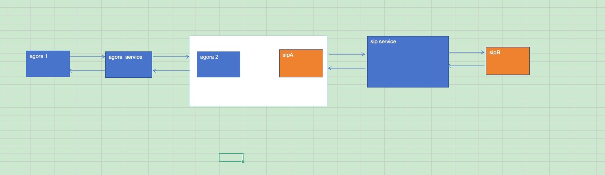

#此方案使用sip和agora背靠背方案

设计图如下：

agora使用官网sdk
sip客户端使用pjsip（之前选用linphone，不如pjsip轻量）
本人使用环境：
ubuntu20.04 + pjsip2.4.1 + agora_rtc_sdk
过程：
1、编译pjsip（参考官网）
    ./configure
    make dep
    make 
    make install

2、测试pjsua

3、修改pjsua2_demo.cpp测试sip功能

4、学习agora rtc sdk的使用

5、核心代码：
class MyAudioMediaPort : public AudioMediaPort
{
private:
    std::ofstream sendFile;
    std::ofstream receiveFile;
    std::ofstream receiveFile2;

     //agora相关
    agora::base::IAgoraService* service;
    agora::agora_refptr<agora::rtc::IRtcConnection> connection;
    agora::agora_refptr<agora::rtc::IMediaNodeFactory> factory;
    agora::agora_refptr<agora::rtc::IAudioPcmDataSender> audioPcmDataSender;
    agora::agora_refptr<agora::rtc::ILocalAudioTrack> customAudioTrack;
    agora::agora_refptr<agora::rtc::IVideoFrameSender> videoFrameSender;
    agora::agora_refptr<agora::rtc::ILocalVideoTrack> customVideoTrack;
    SampleConnectionObserver* connectionObserver;// 这里定义 observer 的类型
    SampleLocalUserObserver* localUserObserver;
    PcmFrameObserver* audioObserver;
    AudioFrameQueue* audioQueue;

public:
    MyAudioMediaPort() 
        : sendFile("/tmp/send.pcm", std::ios::binary | std::ios::app),
          receiveFile("/tmp/receive.pcm", std::ios::binary | std::ios::app),
          receiveFile2("/tmp/receive2.pcm", std::ios::binary | std::ios::app) {
            this->initAgora();
          }

    ~MyAudioMediaPort(){
        this->uninitAgora();
    }

        //agora
    static void agoraAudioFrameCallback(void *user_data, const char* channelId, agora::media::base::user_id_t userId, agora::media::IAudioFrameObserver::AudioFrame& audioFrame) 
    {
        // 处理音频帧数据
        std::cout << "*** 旺旺agora: agora audio frame callback ***" << std::endl;
        size_t audioBytes = audioFrame.samplesPerChannel * audioFrame.channels * sizeof(int16_t);
        if (user_data != nullptr){
            MyAudioMediaPort *pvt = (MyAudioMediaPort *)user_data;
            if (pvt->audioQueue != nullptr){
                pvt->audioQueue->push(audioFrame);
            }
        }

        // std::string fileName = "/tmp/fs_agora_receive_pcm.pcm";
        // FILE* pcmFile;
        // if (!(pcmFile = fopen(fileName.c_str(), "a"))) {
        //     std::cout << "*** 旺旺agora: Failed to create received audio file ***" << std::endl;
        // } 
   
        // if (fwrite(audioFrame.buffer, 1, audioBytes, pcmFile) != audioBytes) {
        //     std::cout << "*** 旺旺agora: Error writing agora audio data: ***" << std::endl;
        // }
        
        // fclose(pcmFile);
        // pcmFile = nullptr;
    }

    void initAgora()
    {
        std::cout << "*** 旺旺agora: agora init ***" << std::endl;

        AgoraOptions options;
        options.appId = "007eJxTYFBY9Vzp+Jb5F5Tuh97jfRd7NNf5RmHSqTUPbPgOP7XLWh6owGBoZGaQmJpskGxkmWZilJhomWJqlpqWlmhpbJaYamRm9naWRHpDICODYeFDRkYGCATxuRlKUotLkjMS8/JScxgYAO4+JIY=";
        options.channelId = "testchannel";
        options.userId = "666666";
        options.video.enable_hw_encoder = false;

        agora::base::IAgoraService* service = nullptr;
        //create agora service
        service = createAndInitAgoraService(false, true, false);
        if (!service) {
            std::cout << "*** 旺旺agora: Failed to create agora service ***" << std::endl;
        } else {
            std::cout << "*** 旺旺agora: create agora service success ***" << std::endl;
        }

        //create agora connection
        agora::rtc::RtcConnectionConfiguration connConfig;
        connConfig.autoSubscribeAudio = true;
        connConfig.autoSubscribeVideo = false;
        connConfig.enableAudioRecordingOrPlayout = true;
        connConfig.clientRoleType = agora::rtc::CLIENT_ROLE_BROADCASTER;
        agora::agora_refptr<agora::rtc::IRtcConnection> connection = service->createRtcConnection(connConfig);
        if (!connection) {
            std::cout << "*** 旺旺agora: Failed to create agora connection ***" << std::endl;
        } else {
            std::cout << "*** 旺旺agora: create agora connection success ***" << std::endl;
        }

        // Subcribe streams from all remote users or specific remote user
        agora::rtc::VideoSubscriptionOptions subscriptionOptions;
        subscriptionOptions.encodedFrameOnly = true;
        //订阅所有音频
        connection->getLocalUser()->subscribeAllAudio();
        //订阅视频？
        // connection->getLocalUser()->subscribeAllVideo(subscriptionOptions);

        //非共享指针方法
        SampleConnectionObserver* connectionObserver = new SampleConnectionObserver();
        connection->registerObserver(connectionObserver);

        //创建本地用户观察者
        SampleLocalUserObserver* localUserObserver = new SampleLocalUserObserver(connection->getLocalUser());

        //注册音频观察者
        PcmFrameObserver* audioObserver = new PcmFrameObserver(this); 
    
        // if (connection->getLocalUser()->setPlaybackAudioFrameBeforeMixingParameters(options.audio.numOfChannels, options.audio.sampleRate)) {
        // if (connection->getLocalUser()->setRecordingAudioFrameParameters(options.audio.numOfChannels, options.audio.sampleRate, 0, 160)) {
        // if (connection->getLocalUser()->setMixedAudioFrameParameters(options.audio.numOfChannels, options.audio.sampleRate, 160)) {
        if (connection->getLocalUser()->setPlaybackAudioFrameParameters(
            options.audio.numOfChannels, options.audio.sampleRate, agora::rtc::RAW_AUDIO_FRAME_OP_MODE_TYPE::RAW_AUDIO_FRAME_OP_MODE_READ_ONLY, options.audio.sampleRate/100 * options.audio.numOfChannels )) {
            std::cout << "*** 旺旺agora: Failed to set audio frame parameters! ***" << std::endl;
        } else {
            std::cout << "*** 旺旺agora: set audio frame parameters success! ***" << std::endl;
        }
        audioObserver->setCallback(agoraAudioFrameCallback);

        localUserObserver->setAudioFrameObserver(audioObserver);
    
        //连接到channel
        if (connection->connect(options.appId.c_str(), options.channelId.c_str(), options.userId.c_str())) {
            /* code */
            std::cout << "*** 旺旺agora: connect to channel failed ***" << std::endl;
        } else {
            std::cout << "*** 旺旺agora: connect to channel success ***" << std::endl;
        }

        //创建media node
        agora::agora_refptr<agora::rtc::IMediaNodeFactory> factory = service->createMediaNodeFactory();
        if (!factory) {
            std::cout << "*** 旺旺agora: Failed to create media node factory ***" << std::endl;
        } else {
            std::cout << "*** 旺旺agora: create media node factory success ***" << std::endl;
        }
    
        //create audio data sender
        agora::agora_refptr<agora::rtc::IAudioPcmDataSender> audioPcmDataSender = factory->createAudioPcmDataSender();
        if (!audioPcmDataSender) {
            std::cout << "*** 旺旺agora: Failed to create audio pcm data sender ***" << std::endl;
        } else {
            std::cout << "*** 旺旺agora: create audio pcm data sender success ***" << std::endl;
        }

        //create audio track
        agora::agora_refptr<agora::rtc::ILocalAudioTrack> customAudioTrack = service->createCustomAudioTrack(audioPcmDataSender);
        if (!customAudioTrack) {
            std::cout << "*** 旺旺agora: Failed to create custom audio track ***" << std::endl;
        } else {
            std::cout << "*** 旺旺agora: create custom audio track success ***" << std::endl;
        }
        
        // Publish audio & video track
        customAudioTrack->setEnabled(true);
        connection->getLocalUser()->publishAudio(customAudioTrack);
        
        // customVideoTrack->setEnabled(false);
        // connection->getLocalUser()->publishVideo(customVideoTrack);

    

        this->service = service;
        this->connection = connection;
        this->factory = factory;
        this->audioPcmDataSender = audioPcmDataSender;
        this->customAudioTrack = customAudioTrack;
        // this->videoFrameSender = videoFrameSender;
        // this->customVideoTrack = customVideoTrack;
        
        this->connectionObserver = connectionObserver;
        connectionObserver->waitUntilConnected(DEFAULT_CONNECT_TIMEOUT_MS);

        this->localUserObserver = localUserObserver;
        this->audioObserver = audioObserver;
        
        this->audioQueue = new AudioFrameQueue(static_cast<size_t>(100));
    }

    void uninitAgora()
    {
        std::cout << "*** 旺旺agora: uninit agora ***" << std::endl;
        if (this->connection && this->connectionObserver){
            // Unpublish audio & video track
            this->connection->getLocalUser()->unpublishAudio(this->customAudioTrack);
            // this->connection->getLocalUser()->unpublishVideo(pvt->customVideoTrack);

        
            this->connection->unregisterObserver(this->connectionObserver);
            this->localUserObserver->unsetAudioFrameObserver();

        
            if (this->connection->disconnect()) {
                std::cout << "*** 旺旺agora: agora disconnect失败 ***" << std::endl;
            }

            this->audioPcmDataSender = nullptr;
            this->customAudioTrack = nullptr;
            this->videoFrameSender = nullptr;
            this->customVideoTrack = nullptr;
            this->connectionObserver = nullptr;
            this->localUserObserver = nullptr;
            this->audioObserver = nullptr;
            this->factory = nullptr;
            this->connection = nullptr;
            this->audioQueue = nullptr;
            this->service->release();
            this->service = nullptr;
        }
    }

    void copyAudioFrameToMediaFrame(const agora::media::IAudioFrameObserver::AudioFrame& audioFrame, MediaFrame& mediaFrame) {
        // 计算 buffer 的大小
        unsigned bufferSize = audioFrame.samplesPerChannel * audioFrame.channels * static_cast<unsigned>(audioFrame.bytesPerSample);

        // 重新分配 mediaFrame.buf 的大小以容纳音频数据
        mediaFrame.buf.resize(bufferSize);

        // 将 AudioFrame::buffer 的数据复制到 MediaFrame::buf 中
        if (audioFrame.buffer) {
            std::memcpy(mediaFrame.buf.data(), audioFrame.buffer, bufferSize);
        }

        // 更新 MediaFrame 的大小
        mediaFrame.size = bufferSize;
    }

    virtual void onFrameRequested(MediaFrame &frame)
    {
        frame.type = PJMEDIA_FRAME_TYPE_AUDIO;
        std::cout << "*** 需要数据 ***" << std::endl;
        std::cout << "send帧类型: " << frame.type << std::endl;
        std::cout << "send数据大小: " << frame.size << " 字节" << std::endl;

        frame.buf.assign(frame.size, 'c'); // 用字符填充数据

        agora::media::IAudioFrameObserver::AudioFrame audioFrame;
        if (this->audioQueue->pop(audioFrame))
        {
            if (audioFrame.samplesPerChannel>0 && audioFrame.channels>0 && audioFrame.buffer!=nullptr) 
            {
                size_t audioBytes = audioFrame.samplesPerChannel * audioFrame.channels * sizeof(int16_t);
                this->copyAudioFrameToMediaFrame(audioFrame, frame);
            } else {
                std::cout << "*** copyAudioFrameToMediaFrame error ***" << std::endl;
            }
        } else {
            std::cout << "*** agora pop error ***" << std::endl;
        }
        

        // 发送的数据示例（用静态数据填充）
        // frame.buf.assign(frame.size, 'c'); // 用字符填充数据
        // // 定义 PCM 数据，例如填充为静态的正弦波或随机数据
        // for (size_t i = 0; i < frame.size / sizeof(int16_t); ++i) {
        //     int16_t sample = static_cast<int16_t>(32767 * sin(2 * M_PI * (110.0 / 16000.0) * i)); // 440 Hz 正弦波
        //     frame.buf[i * sizeof(int16_t)] = static_cast<char>(sample & 0xFF);
        //     frame.buf[i * sizeof(int16_t) + 1] = static_cast<char>((sample >> 8) & 0xFF);
        //  }

        // 将发送数据写入文件
        // if (sendFile) {
        //     sendFile.write(reinterpret_cast<const char*>(frame.buf.data()), frame.size);
        // }
    }

    virtual void onFrameReceived(MediaFrame &frame)
    {
        std::cout << "*** 收到数据 ***" << std::endl;
        std::cout << "receive帧类型: " << frame.type << std::endl;
        std::cout << "receive数据大小: " << frame.size << " 字节" << std::endl;
        
        //发声网
        int datalen = frame.size;
        int16_t* dp = reinterpret_cast<int16_t*>(frame.buf.data());        
        int samplesPer10ms = 8000 / 100;
        if (this->audioPcmDataSender->sendAudioPcmData(dp, 0,0, samplesPer10ms,  agora::rtc::TWO_BYTES_PER_SAMPLE, 1, 8000) < 0) {
            std::cout << "*** 旺旺agora: Failed to send audio frame! ***" << std::endl;                                                    
        } else {
            std::cout << "*** 旺旺agora: send audio frame sucess! ***" << std::endl;                                                    
        }

        // 将接收到的数据写入文件
        // if (receiveFile) {
        //     receiveFile.write(reinterpret_cast<const char*>(frame.buf.data()), frame.size);
        // }

        // // 将缓冲区置为0
        // memset(frame.buf.data(), 0, frame.size);
        // if (receiveFile2) {
        //     receiveFile2.write(reinterpret_cast<const char*>(frame.buf.data()), frame.size);
        // }
    }
};

6、晚点使用虚拟声卡进行数据交换的方案进行分享。（目前设备的虚拟化已经完成，在数据读写同步没有好的思路）

Vx: bkack2w，欢迎交流

